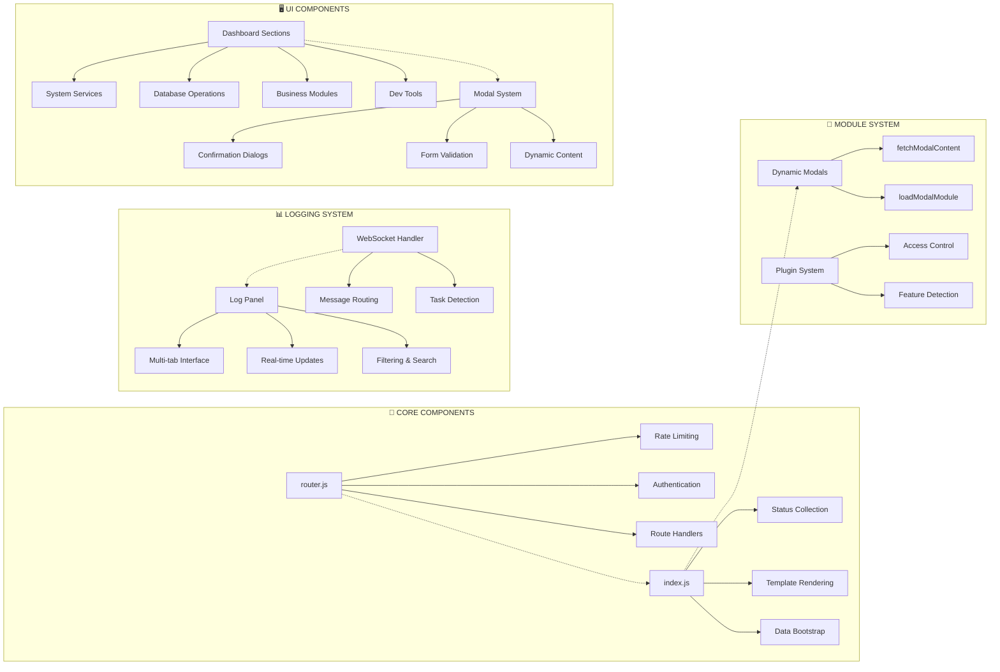
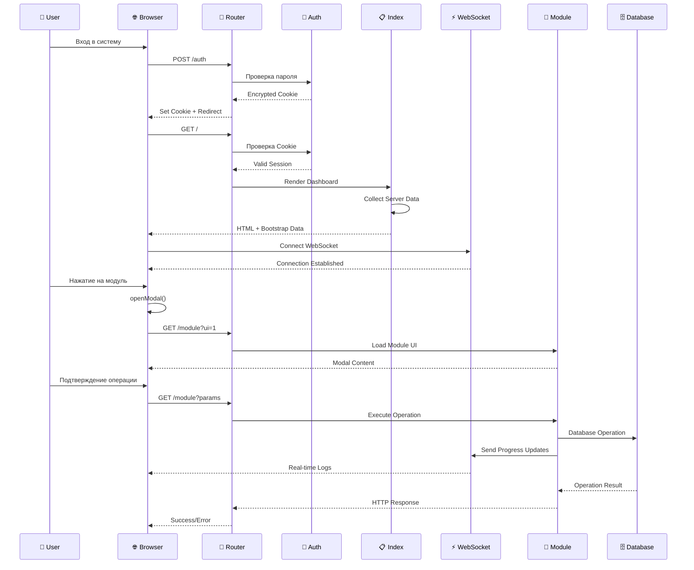
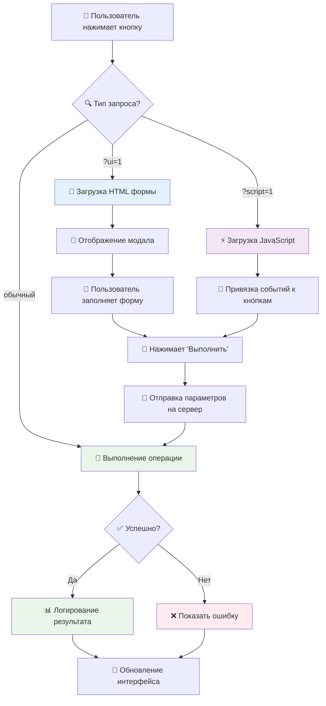
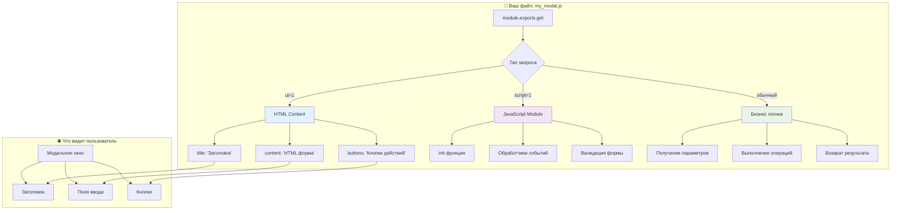

# Схемы архитектуры NEWADMIN

## 1. Общая архитектура системы

```mermaid
graph TB
    %% Клиентская часть
    subgraph "CLIENT SIDE"
        Browser[🌐 Браузер]
        HTML[📄 newadmin.html]
        JS[⚡ newadmin.js]
        CSS[🎨 newadmin.css]

        Browser --> HTML
        HTML --> JS
        HTML --> CSS
    end

    %% Серверная часть
    subgraph "SERVER SIDE - NEWADMIN/"
        Router[🚦 router.js<br/>Express Router]
        Auth[🔐 auth.js<br/>Аутентификация]
        Index[📋 index.js<br/>Main Renderer]

        %% Модули операций
        subgraph "Operation Modules"
            FirstStart[🚀 firststart.js]
            Structures[🏗️ aktualizace_struktur.js]
            NullData[💾 aktualizace_nulovadata.js]
            Init[⚙️ inicializace.js]
            Services[🔧 start/stop_service.js]
            Console[📟 consolelog.js]
            Multiverse[🌌 zalozeni_multiverze.js]
        end

        Router --> Auth
        Router --> Index
        Router --> FirstStart
        Router --> Structures
        Router --> NullData
        Router --> Init
        Router --> Services
        Router --> Console
        Router --> Multiverse
    end

    %% Статические ресурсы
    subgraph "STATIC RESOURCES - WEB/static/v2/"
        subgraph "JavaScript"
            AdminJS[📜 js/admin/newadmin.js]
            Libraries[📚 jQuery, Bootstrap, etc.]
        end

        subgraph "Styles"
            AdminCSS[🎨 css/newadmin.css]
            Fonts[🔤 fonts/]
        end

        subgraph "Assets"
            Icons[🎯 mdi icons]
            Images[🖼️ img/]
        end
    end

    %% Коммуникация
    subgraph "COMMUNICATION"
        HTTP[📡 HTTP/REST API]
        WS[⚡ WebSocket]
        Cookies[🍪 Encrypted Cookies]
    end

    %% Внешние системы
    subgraph "EXTERNAL SYSTEMS"
        DB[(🗄️ MSSQL Database<br/>Multi-version)]
        Repository[📦 SVN Repository]
        Docker[🐳 Docker Services]
        NodeProc[⚙️ Node.js Processes]
    end

    %% Основные потоки данных
    Browser <-->|HTTP Requests| Router
    Browser <-->|WebSocket| WS
    Browser -->|Load Static| AdminJS
    Browser -->|Load Static| AdminCSS

    JS <-->|Real-time Logs| WS
    JS -->|API Calls| HTTP

    Auth -->|Store Session| Cookies
    Index -->|Render Template| HTML
    Index -->|Server Data Bootstrap| JS

    %% Операции с внешними системами
    FirstStart --> DB
    Structures --> DB
    NullData --> DB
    Init --> DB
    Services --> NodeProc
    Services --> Docker
    Multiverse --> Repository
    Console --> NodeProc

    %% Стили и цвета
    classDef client fill:#e1f5fe,stroke:#0277bd,stroke-width:2px
    classDef server fill:#f3e5f5,stroke:#7b1fa2,stroke-width:2px
    classDef static fill:#e8f5e8,stroke:#2e7d32,stroke-width:2px
    classDef comm fill:#fff3e0,stroke:#f57c00,stroke-width:2px
    classDef external fill:#ffebee,stroke:#c62828,stroke-width:2px

    class Browser,HTML,JS,CSS client
    class Router,Auth,Index,FirstStart,Structures,NullData,Init,Services,Console,Multiverse server
    class AdminJS,Libraries,AdminCSS,Fonts,Icons,Images static
    class HTTP,WS,Cookies comm
    class DB,Repository,Docker,NodeProc external
```

## 2. Детальная схема компонентов

## 3. Поток взаимодействий пользователя

## 4. Схема работы модальных окон (ваша зона ответственности)

## 5. Структура вашего модала

---

## 🎯 Как использовать эти схемы:

1. **Схема 1** - общее понимание архитектуры
2. **Схема 2** - детали компонентов системы
3. **Схема 3** - поток действий пользователя
4. **Схема 4** - как работают ваши модалы
5. **Схема 5** - структура файла модала

**Для просмотра установите расширение "Mermaid Preview" в VS Code или откройте на [mermaid.live](https://mermaid.live)**
